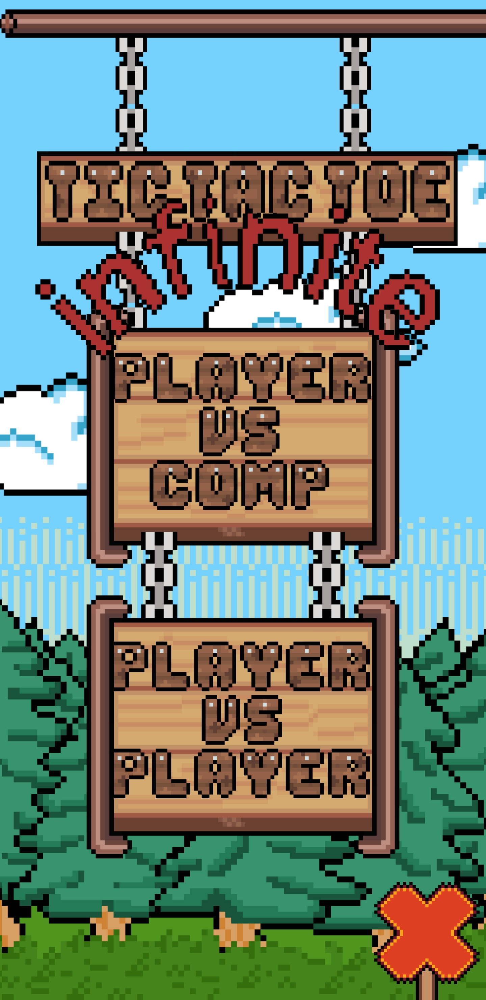
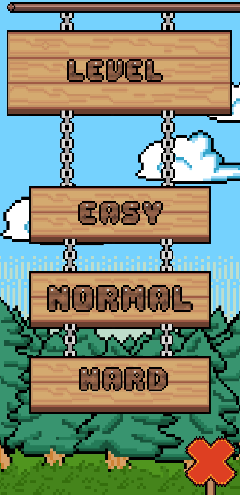
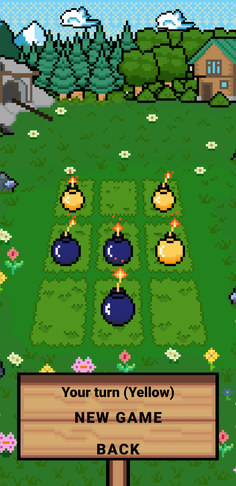
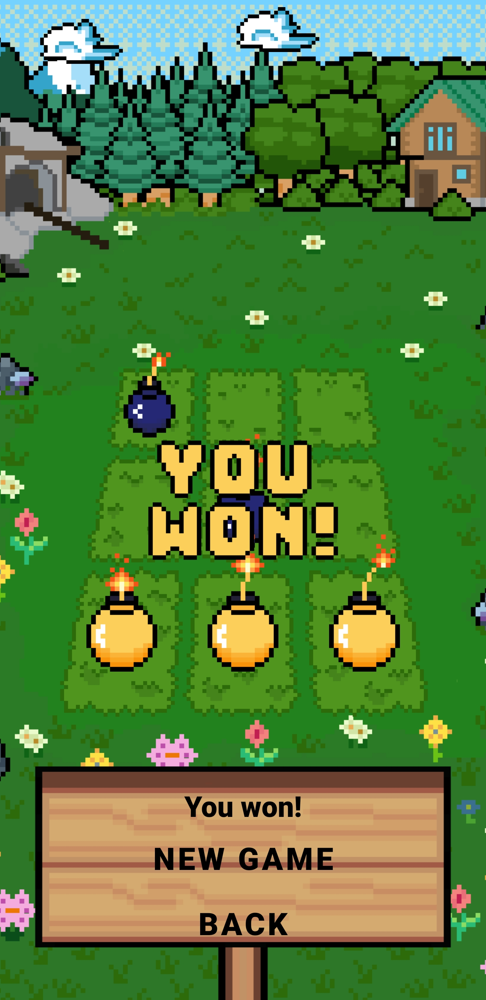

# Tic-Tac-Toe Infinity

---

## 📌 Description (EN)

This application is a classic Tic-Tac-Toe game with extended “Infinity” mechanics, implemented in a retro pixel style. The player interacts with the game board through an intuitive interface, placing elements and making moves in real time.

The project combines simple core mechanics with stylized visuals, including custom buttons, pixel graphics, and sound effects that recreate the atmosphere of classic 8-bit games. The game logic is implemented separately from the user interface, which makes the project easier to scale and maintain.

The application is designed for Android devices and demonstrates the full development cycle: from UI and game logic design to the integration of graphics, sound, and data storage.

---

## 🚀 Skills (EN)

In this project, the fundamentals of Android development were learned and applied, including UI creation, game logic implementation, and event handling. Additional practical skills were gained in pixel art creation, sound design, and version control using Git.

### Android Basics
- Activity lifecycle management (`onCreate`, state handling)  
- UI creation using XML (ConstraintLayout, GridLayout)  
- Connecting UI and logic using Java  

### Architecture & Logic
- Separation of game logic and UI (GameActivity + GameEngine)  
- Class and method design  
- Using enums for game states (IN_PROGRESS, WIN, DRAW)  

### UI/UX
- Interactive elements (buttons, grid cells)  
- Handling user input and events  
- Custom UI design (non-standard shapes, styled buttons)  

### Graphics
- Pixel art (retro style)  
- PNG optimization  
- Asset creation and editing using Aseprite  
  (sprite creation, pixel grid work, palette setup, export for Android)  

### Sound
- Creating sound effects and simple background music using Bosca Ceoil  
  (8-bit melodies, instruments, patterns, audio export)  

### Data
- State saving (SharedPreferences)  
- Game state management  

### Git & GitHub
- Repository creation and management  
- Commit writing and formatting  
- Project synchronization with remote repository  
  (branching was not used)  

### Additional Skills
- Debugging (InflateException, layout issues)  
- Working with libraries and dependencies  

---

## 📸 Screenshots

### Main Screen

### Difficulty Menu

### Gameplay

### Game Over

---

# 🇰🇷 설명 (Korean)

이 애플리케이션은 확장된 “Infinity” 메커니즘을 적용한 클래식 틱택토 게임으로, 레트로 픽셀 스타일로 구현되었습니다. 사용자는 직관적인 인터페이스를 통해 게임 보드와 상호작용하며 실시간으로 말을 배치하고 진행합니다.

이 프로젝트는 단순한 게임 메커니즘과 스타일화된 그래픽을 결합하여 커스텀 버튼, 픽셀 아트, 사운드 효과를 통해 8비트 게임의 분위기를 재현합니다. 게임 로직은 UI와 분리되어 있어 확장성과 유지보수성이 향상되었습니다.

이 애플리케이션은 Android 기기를 대상으로 하며 UI 설계, 게임 로직 구현, 그래픽 및 사운드 통합, 데이터 저장까지 전체 개발 과정을 포함합니다.

---

## 🚀 기술 (Korean)

이 프로젝트를 통해 Android 개발의 기초를 학습하고 적용하였으며, UI 구성, 게임 로직 구현, 이벤트 처리에 대한 실무 경험을 얻었습니다. 또한 픽셀 아트 제작, 사운드 생성, Git을 활용한 버전 관리 능력을 향상시켰습니다.

### 안드로이드 기초
- Activity 생명주기 관리 (`onCreate`, 상태 처리)  
- XML 기반 UI 구성 (ConstraintLayout, GridLayout)  
- Java를 활용한 UI와 로직 연결  

### 구조 및 로직
- 게임 로직과 UI 분리 (GameActivity + GameEngine)  
- 클래스 및 메서드 설계  
- enum을 사용한 게임 상태 관리 (IN_PROGRESS, WIN, DRAW)  

### UI/UX
- 인터랙티브 요소 (버튼, 게임 셀)  
- 사용자 입력 및 이벤트 처리  
- 커스텀 UI 디자인 (비정형 버튼, 곡선 형태)  

### 그래픽
- 픽셀 아트 (레트로 스타일)  
- PNG 최적화  
- Aseprite를 활용한 그래픽 제작  
  (스프라이트 제작, 픽셀 그리드 작업, 팔레트 설정, Android용 экспорт)  

### 사운드
- Bosca Ceoil을 활용한 사운드 및 음악 제작  
  (8비트 멜로디, 악기 설정, 패턴 구성, 오디오 экспорт)  

### 데이터
- 상태 저장 (SharedPreferences)  
- 게임 상태 관리  

### Git & GitHub
- 저장소 생성 및 관리  
- 커밋 작성 및 정리  
- 원격 저장소와 동기화  
  (브랜치는 사용하지 않음)  

### 추가 기술
- 디버깅 (InflateException, 레이아웃 문제)  
- 라이브러리 및 의존성 관리  

---

# 🇷🇺 Описание (Russian)

Данное приложение представляет собой игру в формате классических крестиков-ноликов с расширенной механикой (“Infinity”), реализованную в ретро-пиксельном стиле. Игрок взаимодействует с игровым полем через интуитивный интерфейс, размещая элементы и управляя ходами в реальном времени.

Проект сочетает простую базовую механику с визуально стилизованным оформлением: используются кастомные кнопки, пиксельная графика и звуковые эффекты, создающие атмосферу классических 8-битных игр. Логика игры реализована отдельно от интерфейса, что обеспечивает удобство масштабирования и дальнейшего развития проекта.

Приложение ориентировано на устройства Android и демонстрирует полный цикл разработки: от проектирования интерфейса и игровой логики до интеграции графики, звука и систем хранения данных.

---

## 🚀 Навыки (Russian)

В данном проекте были освоены основы разработки Android-приложений, включая создание пользовательского интерфейса, реализацию игровой логики и работу с событиями. Дополнительно были получены практические навыки в создании пиксельной графики и звукового сопровождения, а также в использовании Git для управления проектом.

### Основы Android-разработки
- Работа с жизненным циклом Activity (`onCreate`, управление состоянием)  
- Создание пользовательского интерфейса через XML (ConstraintLayout, GridLayout)  
- Связывание UI и логики через Java  

### Архитектура и логика приложения
- Разделение логики игры и интерфейса (GameActivity + GameEngine)  
- Проектирование классов и методов  
- Использование enum для описания состояний игры (IN_PROGRESS, WIN, DRAW)  

### Работа с пользовательским интерфейсом (UI/UX)
- Создание интерактивных элементов (кнопки, игровые клетки)  
- Обработка нажатий и пользовательских событий  
- Разработка нестандартного дизайна (искривлённые формы, кастомные кнопки)  

### Графика и визуальный стиль
- Использование пиксельного (ретро) стиля  
- Работа с PNG-ресурсами и их оптимизация  
- Создание и редактирование ассетов через Aseprite  
  (разработка спрайтов, работа с пиксельной сеткой, настройка палитры, экспорт графики для Android)  

### Работа со звуком
- Создание звуковых эффектов и простой фоновой музыки через Bosca Ceoil  
  (генерация 8-битных мелодий, настройка инструментов и паттернов, экспорт аудио для использования в игре)  

### Работа с данными
- Сохранение состояния приложения (SharedPreferences)  
- Управление состоянием игры  

### Работа с Git и GitHub
- Создание и управление репозиторием  
- Коммиты и оформление сообщений  
- Загрузка и синхронизация проекта с удалённым репозиторием  
  (ветвление не использовалось)  

### Дополнительные навыки
- Отладка ошибок (InflateException, проблемы с layout)  
- Работа с внешними библиотеками и зависимостями
